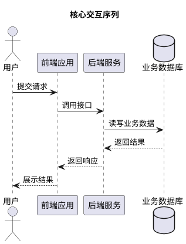

# PlantUML 图件规范

在创建、修改、审查或放置 `.puml` 源文件、UML 图、E-R 图和生成的 PNG 图时加载本文件。架构图目录规则另见 `document-structure.md`。

## 官方文档

PlantUML 官方主页：https://plantuml.com/

| 图类型 | 官方文档 |
| --- | --- |
| 序列图 | https://plantuml.com/en/sequence-diagram |
| 用例图 | https://plantuml.com/en/use-case-diagram |
| 类图 | https://plantuml.com/en/class-diagram |
| 活动图 | https://plantuml.com/en/activity-diagram-beta |
| 组件图 | https://plantuml.com/en/component-diagram |
| 状态机图 | https://plantuml.com/en/state-diagram |
| 对象图 | https://plantuml.com/en/object-diagram |
| 部署图 | https://plantuml.com/en/deployment-diagram |
| E-R 图（Chen 记法） | https://plantuml.com/en/er-diagram；可访问官方入口：https://plantuml.com/er-diagram |
| IE 实体关系图（Information Engineering） | https://plantuml.com/zh/ie-diagram |

## 文件组织

- 架构相关图件放在 `docs/architecture/figure/`。
- PlantUML 源文件使用 `.puml`，生成图使用 `.png`；同一图件源文件和导出图保持同名。
- 文件名使用英文 kebab-case，例如 `overall-component-view.puml`、`core-interaction-sequence.puml`、`er-model.puml`。
- 不只保存 PNG。必须保留可修改的 `.puml` 源文件。

## 通用语法

- 普通 UML 图和 IE 实体关系图使用 `@startuml` 与 `@enduml` 包裹；E-R 图 Chen 记法使用 `@startchen` 与 `@endchen`。
- 每个图件应包含 `title`，标题与论文图题含义一致，但不必完全重复“图 x-x”编号。
- 对中文或含空格的元素使用引号和 `as` 别名，例如 `"授权服务" as AuthService`。后续连线统一使用别名，避免长中文名造成源文件难读。
- 一张图只表达一个论文目的：结构、交互、状态、部署、数据关系或用例边界。不要把多个目的塞进同一图。
- 复杂图优先用 `package`、`frame`、`node`、`database`、`cloud`、`rectangle` 等容器分组，而不是依靠颜色解释语义。
- 避免过度使用主题、阴影和装饰色。论文图以黑白打印可读为底线。
- 图中的名称应与论文正文、代码模块、接口或数据实体保持一致。

## 图类型选择

| 论文目的 | 推荐图类型 | 重点 |
| --- | --- | --- |
| 角色与系统边界 | 用例图 | 参与者、系统边界、核心用例 |
| 核心交互流程 | 序列图 | 参与对象、调用顺序、同步/异步、异常分支 |
| 模块静态结构 | 组件图 | 组件职责、依赖关系、接口方向 |
| 概念数据模型 | E-R 图（Chen 记法） | 实体、关系、属性和概念层约束 |
| 详细数据设计 | IE 实体关系图 | 数据表/实体、字段、主键、外键、强制属性和基数 |
| 部署与运行环境 | 部署图 | 节点、进程、服务、网络边界 |
| 状态迁移 | 状态机图 | 状态、事件、守卫条件、终止状态 |
| 流程控制 | 活动图 | 分支、并行、开始/结束、关键活动 |
| 类和对象关系 | 类图/对象图 | 类、属性、方法、关联、实例快照 |

## 写作和审查标准

- 图前正文应说明为什么需要该图、图中元素代表什么、读者应关注哪个关系。
- 图后正文应解释关键结论，不重复罗列所有节点和箭头。
- 每条连线应有明确语义。序列图消息使用动词短语；组件图依赖使用接口、调用、订阅、读写或部署关系；E-R 图和 IE 实体关系图关系标注基数。
- 详细设计中描述数据库表结构、字段级属性、主外键和一对多/可选关系时，可使用 IE 实体关系图；概念建模阶段仍可使用 Chen 记法 E-R 图。
- 图件不得表达代码或文档中不存在的模块、接口、状态或数据实体。
- 如果图来自代码总结，应先核对当前实现；如果图是设计目标，应在正文中明确其设计阶段和实现边界。
- 修改 `.puml` 后必须重新生成对应 `.png`，并检查论文中使用的导出版是否同步。

## 最小示例



## 论文图件强版式控制

当论文图件不仅要求语义正确，还要求严格仿照指定版式时，不要完全依赖 PlantUML 自动布局。PlantUML 适合维护 UML 语义，但其布局由 Graphviz 或内部引擎决定，参与者到系统边界内用例的连线可能被渲染成曲线、折线或自动绕线，即使设置 `skinparam linetype line`、`straight`、`polyline`，也不一定满足论文排版要求。

### 推荐做法

- 保留 `.puml` 作为语义源文件，记录参与者、系统边界和用例关系。
- 当图件需要固定版式、直线连线、标题框位置或黑白打印效果时，额外维护 `.svg` 作为论文排版源。
- 从 `.svg` 导出 `.png`，保证最终论文插图与排版要求一致。
- `.puml`、`.svg`、`.png` 使用同名文件，便于维护，例如：
  - `top-level-use-case.puml`
  - `top-level-use-case.svg`
  - `top-level-use-case.png`

### 适用场景

使用 SVG 排版源处理以下要求：

- 系统名称必须固定在左上角或指定位置。
- 图中不能出现 PlantUML 自动生成的图题。
- 不展示功能域、包、注释或辅助说明。
- 用例名称不带编号，只保留业务名称。
- 参与者与用例之间必须是直线，不能出现折线或曲线。
- 需要仿照论文、教材或学校模板中的用例图样式。

### SVG 生成注意事项

- 显式添加白色背景，避免透明 PNG 在查看器或论文工具中显示为黑底：

```xml
<rect x="0" y="0" width="..." height="..." fill="#fff"/>
```

使用 <line> 绘制参与者与用例之间的关联线，避免自动路由。
使用 <ellipse> 绘制用例，使用 <rect> 或 <path> 绘制系统边界和左上角标题栏。
中文字体优先使用系统可用字体，例如 "Hiragino Sans"、"Songti SC"、"Noto Sans CJK SC"。
生成 PNG 后必须进行视觉检查，不只检查文件是否存在。

### 推荐命令
从 SVG 导出 PNG：
rsvg-convert -w 1040 -h 720 docs/requirements/diagrams/top-level-use-case.svg \
  -o docs/requirements/diagrams/top-level-use-case.png
检查 PNG 文件：
file docs/requirements/diagrams/top-level-use-case.png\
